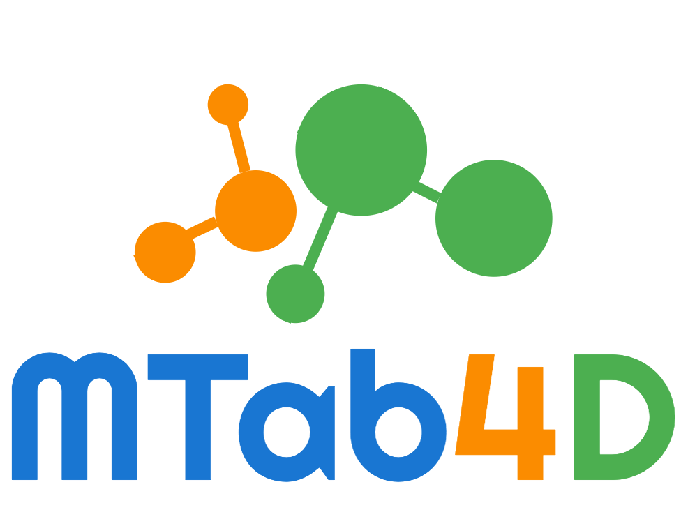

---
MTab4DBpedia: Semantic Annotation for Tabular Data with DBpedia

### Demo
- Table Annotation: https://dbpedia.mtab.app/mtab
- Entity Search: https://dbpedia.mtab.app/search

### API

### 1. Entity Search: 
Search relevant entities from DBpedia (2016-10)

#### API: https://dbpedia.mtab.app/api/v1/search

#### Parameters: 
- q: search query. This parameter is required.
- limit: maximum number of relevant entities to return. The value should be from 1 to 1000. The default value is 20.
- m: one of three value [b, f, a]. The default value is a.
    - b: keywords search with BM25 (hyper-parameters: b=0.75, k1=1.2).
    - f: fuzzy search with an edit-distance (Damerau–Levenshtein distance). 
    - a: the weighted aggregation of keyword search and fuzzy search. 
      
#### Example:
The query is Tokyo, and get 20 relevant entities.

**Command:** 
```bash
curl --request POST --header "Content-Type: application/json" --data '{"q":"Tokyo", "limit":20}' https://dbpedia.mtab.app/api/v1/search
```

### 2. Get entity information: 
Get entity information from DBpedia (2016-10). The responded object include DBpedia title, mapping to Wikidata, Wikipedia, label, Aliases, types, pagerank score, entity statements, and literal statements. 

#### API: https://dbpedia.mtab.app/api/v1/info

#### Parameters: 
- q: entity name. This parameter is required.

#### Example: 
Get information of the entity Hideaki Takeda

**Command:** 
```bash
curl --request POST --header "Content-Type: application/json" --data '{"q":"Hideaki Takeda"}' https://dbpedia.mtab.app/api/v1/info
```

### 3. Table annotation:
Table annotation with MTab4DBpedia. 

#### API: https://dbpedia.mtab.app/api/v1/mtab

#### Parameters: 
- table: table of content. This parameter is required.
- predict_target: True or False. Let MTab predict target of matching
- tar_cea: cell-entity targets
- tar_cta: column-type targets
- tar_cpa: relation-property targets
- round_id: from [1-5]. [1, 2, 3, 4] is the four rounds of SemTab 2019. 5 is Tough Tables dataset
- search_mode: "b": using BM25 entity search, "f": using entity fuzzy search, "a": using Entity search aggregation mode of "b" and "f"

#### Example:
Please refer m_main.py on how to use it. 

### 4. Evaluation:
Submit annotation file (CEA, CTA, CPA), then get the results.

#### API: https://dbpedia.mtab.app/api/v1/eval

#### Parameters: 
- round_id: from [1-5]. [1, 2, 3, 4] is the four rounds of SemTab 2019. 5 is Tough Tables dataset
- res_cea: cell-entity results
- res_cta: column-type results
- res_cpa: relation-property results

#### Example:
Please refer m_main.py on how to use it. 

### 5. Numerical labeling
Annotate numerical column of tables with Knowledge Graph properties

#### API: https://dbpedia.mtab.app/api/v1/num

#### Parameters:
- values: numerical values
- limit: maximum number of relevant entities to return. 
- get_prop_class: get more semantic labels as a format of property||class

#### Example:

**Command:** 
```bash
curl --request POST --header "Content-Type: application/json" --data '{"values":[1.50, 1.51, 1.52, 1.53, 1.54], "limit": 5}' https://dbpedia.mtab.app/api/v1/num
```
or please refer m_main.py for other examples. 

## Reproduce MTab4DBpedia results:
1. Clone MTab4DBpedia, and open project
```bash
git clone https://github.com/phucty/mtab4dbpedia.git
cd mtab4dbpedia
```

2. Create conda environment, activate, and install mtab4dbpedia
```bash
conda create -n mtab4dbpedia python=3.6
conda activate mtab4dbpedia
pip install -r requirements.txt
```

3. Other setup:

- Change DIR_ROOT in m_setting.py to your project directory. Current value is (This is the directory in my laptop)
```
DIR_ROOT = "/Users/phuc/git/mtab4dbpedia"
```

- Decompress data files
```
data/semtab_2019_dbpedia_2016-10.tar.bz2
data/semtab_org.tar.bz2
```

4. Run experiment for 
   - 5 datasets: 4 rounds of SemTab 2019, and Tough Tables (Round 5)
   - 2 datasets version: SemTab 2019 (original), and adapted SemTab 2019 DBpedia 2016-10
```
python exp_semtab.py
```


### Datasets:
1. Original version of [SemTab 2019](https://doi.org/10.5281/zenodo.3518530) and [Tough Tables](https://doi.org/10.5281/zenodo.3840646)
2. [Adapted SemTab 2019 and Tough Tables with DBpedia 2016-10](http://doi.org/10.5281/zenodo.4922769)
Note:
- Why do we need the adapted version? 
  
To make a fair evaluation, it is important to have the same target DBpedia version because DBpedia change overtime. Additionally, using up-to-date resources also could yield a higher performance since data is more complete than older version. It is unfair with the previous study used the older version of DBpedia.

- How to adapt the dataset with DBpedia 2016-10?
  - Open resources for reproducibility:
    - Classes, properties, and their equivalents
    - Entity dump (all information about entities) or using API Get Entity Information 
    - API entity search based on DBpedia entity label and aliases (multilingual)
      
  - Adapt Ground Truth:
    - Make targets and ground truth consistence
    - Remove invalid entities, types, properties.
    - Adding redirect, equivalent entities, types, and properties.
    - Remove prefix to avoid redirect issues (it shows page instead of resource).
    
### References
- Phuc Nguyen, Hideaki Takeda, MTab: Tabular Data Annotation, NII Open House June 2021. [[video](https://youtu.be/1ByffPp2alg?t=3269)]

- Phuc Nguyen, Ikuya Yamada, Hideaki Takeda, [MTabES: Entity Search with Keyword Search, Fuzzy Search, and Entity Popularities](https://drive.google.com/file/d/10Tl0Qd5gxFSiCsnSjJbvRSUiDXW-Kifn/view?usp=sharing), In The 35th Annual Conference of the Japanese Society for Artificial Intelligence (JSAI), 2021. [[video](https://drive.google.com/file/d/1gYSP619HcMT-sE6iD3LiQeRtZw9UZTWQ/view?usp=sharing)]


- Phuc Nguyen, Ikuya Yamada, Natthawut Kertkeidkachorn, Ryutaro Ichise, Hideaki Takeda, [MTab4Wikidata at SemTab 2020: Tabular Data Annotation with Wikidata](http://ceur-ws.org/Vol-2775/paper9.pdf), In SemTab@ISWC, 2020. [[video](https://drive.google.com/file/d/1vz-6nkc9t6MQZYzgg-PZNLs-9TT86wRD/view?usp=sharing)]

  
- Phuc Nguyen, Natthawut Kertkeidkachorn, Ryutaro Ichise, Hideaki Takeda [MTab: Matching Tabular Data to Knowledge Graph using Probability Models](http://ceur-ws.org/Vol-2553/paper2.pdf), In SemTab@ISWC, 2019, [[slides](http://www.cs.ox.ac.uk/isg/challenges/sem-tab/2019/slides/MTab.pptx)]

  
### Awards:
- 1st prize at SemTab 2020 (tabular data to Wikidata matching). [Results](http://www.cs.ox.ac.uk/isg/challenges/sem-tab/2020/results.html)
- 1st prize at SemTab 2019 (tabular data to DBpedia matching). [Results](http://www.cs.ox.ac.uk/isg/challenges/sem-tab/2019/results.html)

### Citing

If you find MTab4DBpedia tool useful in your work, and you want to cite our work, please use the following referencee:
```
@article{Nguyen2022MTab4DSA,
  title={MTab4D: Semantic annotation of tabular data with DBpedia},
  author={Phuc Tri Nguyen and Natthawut Kertkeidkachorn and Ryutaro Ichise and Hideaki Takeda},
  journal={Semantic Web},
  year={2022}
}
```

### Contact
Phuc Nguyen (`phucnt@nii.ac.jp`)
